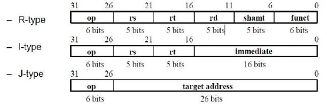

<h1 align='center'> MIPS Processor Simulator</h1>

This work was developed for **Computer Architecture course** at CCE Department, Faculty of Engineering, Alexandria University in Spring 2018 Offering.
Assignments were based on labs of *"Digital Design and Computer Architecture" book by David Harris and Sarah L. Harris*.

## Overview
An **instruction set architecture** is an interface that defines the hardware operations which are available to software. Any instruction set can be implemented in many ways. These many ways are called **microarchitectures**.
We build a simulator (using SystemVerilog) for MIPS processor for three different micro-architectures: (Follow links for full details on each)

- [Single-cycle Microarchitecture](./single-cycle/README.md)
- [Multi-cycle Microarchitecture](./multi-cycle/README.md)
- [Pipelined Microarchitecture](./pipelined/README.md)

## Specifications of the MIPS Machine: The Architecture 

MIPS Is a **RISC (Reduced Instruction Set Computer)** processor. Compared with their **CISC (Complex Instruction Set Computer)** counterparts (such as the Intel Pentium processors), RISC processors typically support fewer and much
simpler instructions.

A RISC processor can be made much faster than a CISC processor because of its simpler design. RISC processors typically have a **load-store
architecture**; there are two instructions for accessing memory and none of the other instructions can access memory directly:  

- a load instruction to load data from memory, 
- a store instruction to write data to memory. 

### Instruction Set Supported 
Our ISA is simplified to support 5 arithmetic and logical, 1 branch instruction, 1 jump instruction, and 1 immediate instruction. These instructions are shown in the table below.

- **Arithmetic and Logical:**     *add, sub, or, and, slt*
- **Branch and Jump:**            *beq, j*
- **Immediate:**                  *addi*

### Instruction Formats 

All MIPS instructions are 32-bit long. There are 3 different instruction formats.

### Memory System.
It’s easier to use a **Harvard architecture** at first, with programs and data stored in separate memories. We use 2 different memories (i.e. Instruction Memory, Data Memory).
Each Memory is responsible for a certain function, 
- Instruction Memory reads the test program machine code from a file and stores it. (specified in “imem” module)

- While, Data Memory is the memory that contains all the data values and addresses that the processor needs to allocate within executing a certain program. (specified in “dmem” module)

### Registers 
The 32 registers are available and stored in the register file (specified in “regfile” module).

### Datapath and Controls
A datapath contains all the functional units and connections necessary to implement an instruction set architecture.
For our single-cycle implementation, we use:
- two separate memories, 
- an ALU, 
- some extra adders, 
- 4 multiplexers, 
- a shifter by 2, 
- a sign extender.
- MIPS is a 32-bit machine, so most of the buses are 32-bits wide.

A control unit tells the datapath what to do, based on the instruction that’s currently being executed.
Our processor has **nine control signals** that regulate the datapath; these can be generated by a combinational circuit with the instruction’s 32-bit binary encoding as input.

---

<h3 align='center'>Made with :heart:<h3>
