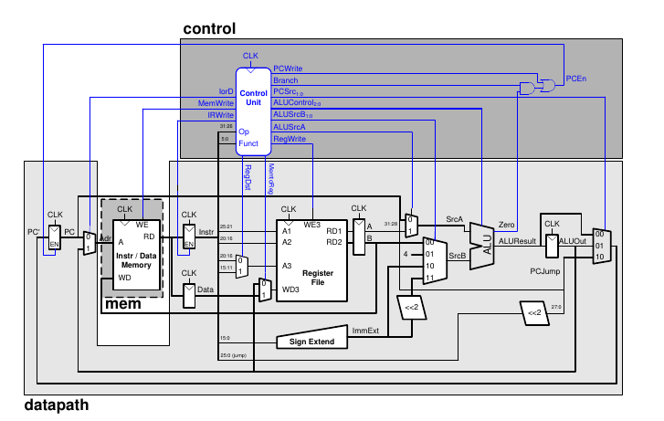
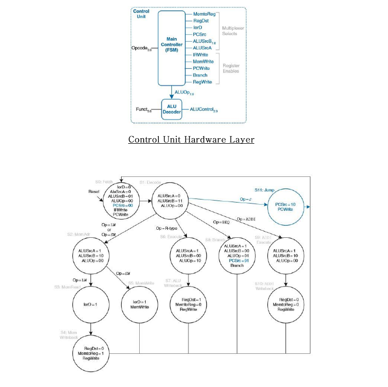
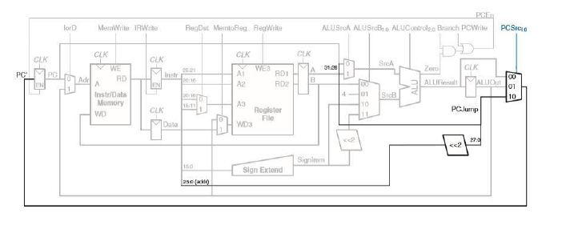

<h1 align='center'> Multi Cycle Microarchitecture MIPS Processor</h1>

  

In a basic multi-cycle implementation, the multi-cycle processor addresses the weaknesses shown by the single cycle microarchitecture as follows:
- Breaking an instruction into multiple shorter steps. In each short step, the processor can read or write the memory or register file or use the ALU. Different instructions use different numbers of steps, so simpler instructions can complete faster than more complex ones.
- The processor needs only one adder; this adder is reused for different purposes on various steps.
- The processor uses a combined memory for instructions and data. The instruction is fetched from memory on the first step, and data may be read or written on later steps.

Our multicycle processor matchs the design from the figure above taken from the textbook. 
The multicycle processor is divided into three units: the controller, datapath, and mem (memory) units.  
On contrast with the single cycle microarchitecture, we use different memory system as we use one shared memory for both instruction memory and data memory. 
This will be accompanied with a multiplexer and a select line to support both memories accordingly. 

## Design of the Control Unit

The controller unit comprises:
- the Main Decoder that takes OP5:0 as inputs, and 
- the ALU Decoder that takes as inputs ALUOp1:0 and the Funct5:0 code from the 6 least significant bits of the instruction.
- the gates needed to produce the write enable signal, PCEn, for the PC register.

The control unit is the most complex part of the multicycle processor. It consists of two
modules, the Main Decoder and the ALU Decoder. A control unit tells the Datapath what to do, based on the instruction that’s currently being executed.

  

The controller module can be found in “mips_controller” file. The controller module can be regarded as the container that holds both the main controller and the ALU decoder found in “mips_maindecoder” and “mips_aludecoder” files respectively. 

It also creates PCEn signal from 3 other signals (Branch, PCWrite, Zero):

- Branch and PCWrite are outputs from the main controller module and used internally within the controller.
- Zero are input to the controller module. This can be shown in this Verilog instruction taken from the controller module,  **pcen=pcwrite | (branch & zero)**

Implementing a FSM in Verilog code was shown in Chapter 4 Section 4.6 with examples. I followed Example 4.30 to implement my own FSM in the main decoder module. 
The code is divided into 3 main code blocks, and can be found in “mips_maindecoder.sv” file:

- First block --> state register block (assign state at clock cycle).
- Second block --> next state block (assign next state value depending on current state).
- Third block --> output logic block (assign outputs to states).

Take care that I considered the following when naming my states. (The same notation followed from the textbook)
- S0 --> Fetch state
- S1 --> Decode state
- S2 --> MemAdr state
- S3 --> MemRead state
- S4 --> MemWriteBack state
- S5 --> MemWrite state
- S6 --> Execute state
- S7 --> ALUWriteback state
- S8 --> Branch state
- S9 --> ADDIEexute state
- S10 --> ADDIWriteback state
- S11 --> JUMP state

## Design of the Datapath
In the single-cycle design, we used separate instruction and data memories because we needed to read the instruction memory and read or write the data memory all in one cycle.  
Now, we choose to use a combined memory for both instructions and data. This is more realistic, and it is feasible because we can read the instruction in one cycle, then read or write the data in a separate cycle. The PC and register file remain unchanged.

In Section 7.4.1 & 7.4.3 in the reference book, a step by step procedure to construct the full Datapath that supports the following instructions (lw / sw / R-type / addi / beq / j). 
A full constructed path at the end of the section can be shown below, this Datapath design is the one we follow.

  

## Performance Analysis of the Multi-cycle Microarchitecture 

Performance of the multi-cycle microarchitecture can be analyzed so we determine if it is efficient enough to use it or no.
The performance analysis is done in section 7.4.4 and is mentioned as in the reference book below.

The **execution time** of an instruction depends on both the number of cycles it uses and the cycle time, the multicycle processor uses varying numbers of cycles for the various instructions. 
However, the multicycle processor does less work in a single cycle and, thus, has a shorter cycle time.
The multicycle processor requires: 
- three cycles for beq and j instructions, 
- four cycles for sw, addi, and R-type instructions, 
- and five cycles for lw instructions.

The **CPI** depends on the relative likelihood that each instruction is used. The SPECINT2000 benchmark consists of approximately 25% loads, 10% stores, 11% branches, 2% jumps, and 52% R-type instructions.

 Average CPI = (0.11+0.02) (3) +(0.52+0.10) (4) + (0.25) (5) =4.12. 

This is better than the worst-case CPI of 5, which would be required if all instructions took the same time. (Single Cycle Microarchitecture)

However, when calculating the execution time using the same Tc and same 100 billion instruction program as in the single cycle performance analysis we found the following,

 Execution time is= (100×109 instructions) (4.12 cycles/instruction) (325×10−12 s/cycle) =133.9 seconds.

The single-cycle processor had a total execution time of 92.5 seconds. Thus, we conclude that multi-cycle performance is worse than the single cycle processor.

---
