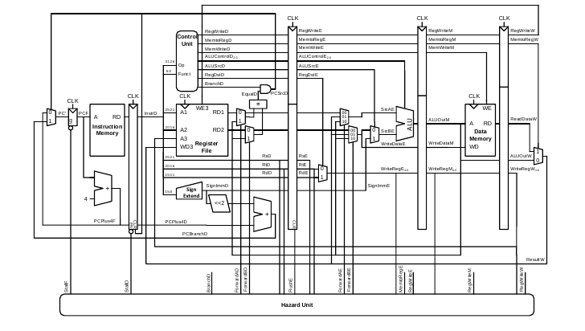
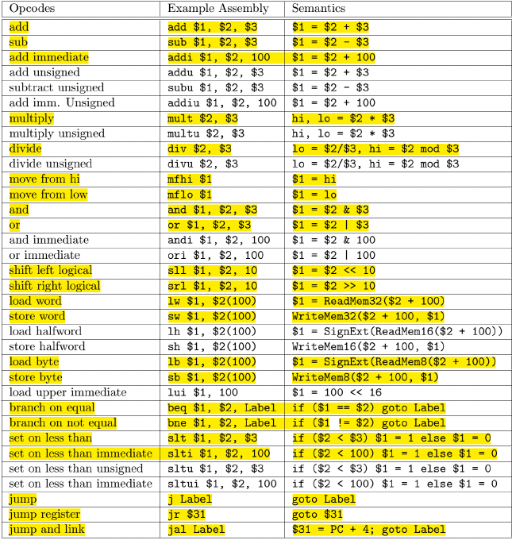

<h1 align='center'> Pipelined Microarchitecture MIPS Processor</h1>

  

Now, we will implement a five-stage MIPS with piplined micro-architecture, which is the most common organization for MIPS and is similar to what is described in the book and in class:
1. Fetch
2. Decode
3. Execute
4. Memory
5. Writeback

The pipeline should: fetch instructions to execute from the code memory and increment the program counter by 4; decode each
instruction; select arguments from the register file; compute results; do nothing in the memory stage; and store results back in the register file. 

The design contain a program counter, a separate data and code memories (Harvard architecture), a register file, an ALU, and any other components needed, along with the instruction
decode and control circuits and a hazard unit. At the end of the work, the processor correctly execute all of the **highlighted instructions in the table below**:

  

## But, what is Pipelining or Parallelism?

The speed of a system is characterized by the latency and throughput of information moving through it. A token is a group of inputs that are processed to produce a group of outputs. The latency of a system is the time required for one token to pass through the system from start to end. The throughput is the number of tokens that can be produced per unit time.

The throughput can be improved by processing several tokens at the same time. This is called parallelism, and it comes in two forms: spatial and temporal. 

- With spatial parallelism, multiple copies of the hardware are provided so that multiple tasks can be done at the same time. 
- With temporal parallelism, a task is broken into stages, like an assembly line. Although each task must pass through all stages, a different task will be in each stage at any given time so multiple tasks can overlap.

Temporal parallelism is commonly called pipelining. Spatial parallelism is sometimes just called parallelism, but we will avoid that naming convention because it is ambiguous.

### Properties of a pipelined microarchitecture
- Divides the single-cycle processor into five pipeline stages.
- Five instructions can execute simultaneously, one in each stage.
- Each stage has only one-fifth of the entire logic, the clock frequency is almost five times faster. Hence, the latency of each instruction is ideally unchanged, but the throughput is ideally five times better.
- Introduces some overhead, so the throughput will not be quite as high as we might ideally desire but pipelining nevertheless gives such great advantage for so little cost.
- All modern high-performance microprocessors are pipelined.

## Implementation Steps

1. The Datapath and control signals as shown in the figure above supports the following instructions only (lw, sw, and, or, add, sub, beq, addi).

2. We then add extendibility of (j jumpAdr) operation by using a 3-input mux instead of a 2-input mux and allowing an extra bus to follow through the PC register. This requires that the control select signal of that mux to be 2 bits wide instead of 1 bit wide to select 10 in case of the jump address bus.

3. Now, the MIPS processor supports a simplified subset of the ISA. We then added the following new instructions on the MIPS Implementation in the following order: (mfhi, mflo, mult, div, sll, srl, slti, lb, sb, jr, jal, bne). Notice how we took core first with artithmetic operations first, then shift and finally jump operations.

4. We tested each instruction we implemented in the ISA using a different file for  each instruction and tested the full program then with the test program found in section 7.6.3 from the textbook.

### Modules & Files
This section is considered the reference to reach any module in our project.We created 10 files as follows,

1. File “mips_interface.sv”, that includes the “top” module which acts as the user interface to the processor including 3 other modules (“mips”, “imem”, “dmem”).
2. File “mips_processor.sv”, that includes the “mips” module. (which is the processor itself)
3. File “mips_datamemory.sv”, that includes the “dmem” module. (which is the data memory)
4. File “mips_instructionmemory.sv”, that includes the “imem” module. (which is the instruction memory).
5. File “mips_controller.sv”, that includes the “controller” module. (which is the control unit).
6. File “mips_maindecoder.sv”, that includes the “maindec” module (which is the main decoder).
7. File “mips_aludecoder.sv”, that includes the “aludec” module (which is the alu decoder).
8. File “mips_datapath.sv”, that includes the “datapath” module (which contains all needed Datapath).
9. File “mips_blocks.sv”, that includes all the building blocks (including the register file) needed by the Datapath and the controller to implement the ISA.
10. File “mips_hazardunit.sv”, that includes the which is the unit responsible for the data and control hazxards handling using various methods. (“hazardunit” module).
11. File “mips_coprocessor64.sv” that includes an added co-processor that handles 64-bit operations such as MULT and control the hi and lo registers which are not included in register file.

---
