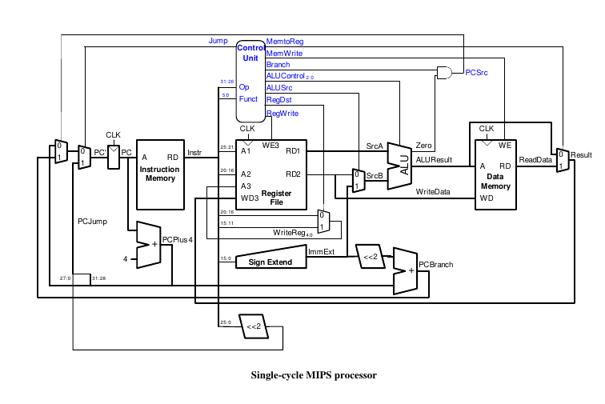
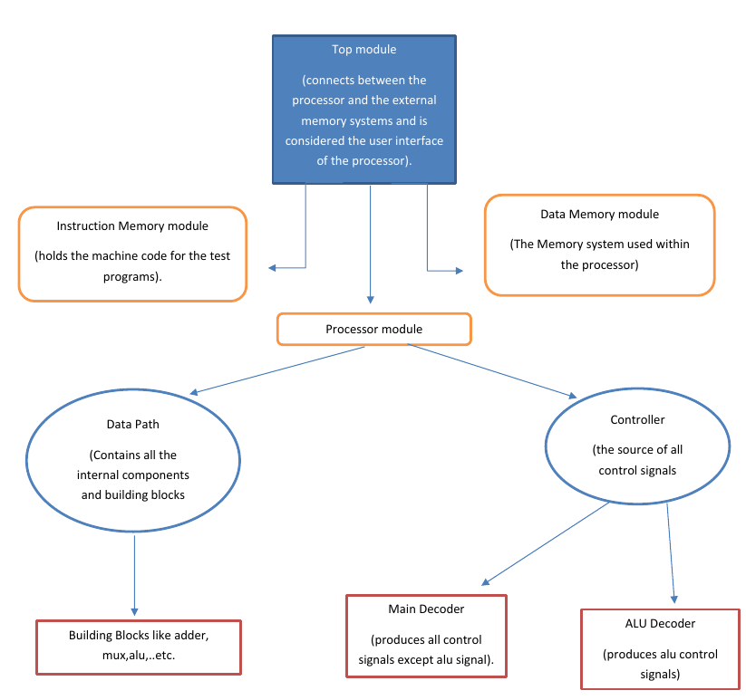
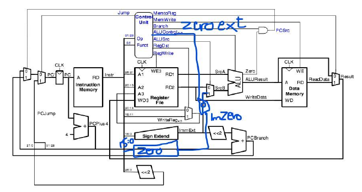
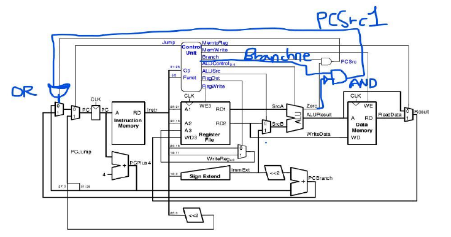

<h1 align='center'> Single Cycle Microarchitecture MIPS Processor</h1>

  

Our model of the single-cycle MIPS processor divides the machine into **two major units:** *the
control and the datapath*. Each unit is constructed from various functional blocks. The datapath contains the 32-bit ALU, the register file, the sign extension logic, and five multiplexers to choose
appropriate operands.

The single-cycle microarchitecture is where simply each instruction is executed in a full one cycle. Properties of a single-cycle microarchitecture aside of the single cycle time are:
- long cycle time, determined by the longest instruction (“lw”).
- Instructions same size.
- Source registers always in same place.
- Immediate same size, location.
- Operations always on registers/immediate.

## Building the single-cycle MIPS processor
The SystemVerilog single-cycle MIPS module is given in Section 7.6 of the text. We use these to implement the MIPS processor and add to it the ALU we implemented in Lab 1 so that they work coherently. 

Understand the files, and modules of the system. 
- The **mips** module, which instantiates two sub-modules, controller and datapath.
- The **controller** module and its submodules. It contains two sub-modules: maindec and aludec.
- The **maindec** module produces all control signals except those for the ALU. 
- The **aludec** module produces the control signal, alucontrol[2:0], for the ALU.
- The **datapath** has quite a few submodules. Make sure you understand why each submodule is there and where each is located on the MIPS single-cycle processor schematic. Make sure you understand why each submodule is there and where each is located on the MIPS single-cycle processor schematic. 
- The **highest-level module, top**, includes the instruction and data memories as well as the processors. 
- Each of **the memories** is a 64-word × 32-bit array. The instruction memory needs to contain some initial values representing the program.

  

## Testing the single-cycle MIPS processor

In a complex system, if you don’t know what to expect the answer should be, you are unlikely to
get the right answer. Begin by predicting what should happen on each cycle when running the
program. We simulate our processor with ModelSim software. 

- We added a new file called “mips_testbench” where we added the “testbench” module. 
- We added a new text file called “memfile.dat” which contains the machine code of the assembly code specified in section 7.6.3 which we will use for this test.
- The testbench checks the correctness of the test program depending on the last instruction executed.  If all goes well, the testbench will print “Simulation succeeded.”

## Modifying the MIPS single-cycle processor

We now modify the MIPS single-cycle processor by **adding the ori and bne instructions**. We draw our changes directly onto the schematic. Then modify the
main decoder and ALU decoder as required. 

### First: Changes needed for implementing “ori”

Our implementation cost is 1 new control signal, 1 new multiplexer, 1 new zero extender device and 2 more bus lines.

  

- We added a zero-extender device that takes input 16 bits and extends them to 32 bits with adding 16 zeros. (this is needed because logical immediate instructions zero-extend the immediate not sign extend it as the arithmetic instructions)

- Then we took the output of that zero-extender with the output of the sign-extender into a 2-input mux which has a control signal that we added to the outputs of the controller named “zeroextend”.
Where, if this signal is equal to 1 🡪 the immediate is zero-extended but if it is equal to zero🡪 the immediate is sign extended. 

- Then the output of this mux is multiplexed in another 2-input mux with RD2 bus from register file as second input. The output of this mux is then the source B value that is the input of the ALU

### Second:  Changes needed for implementing “bne”

Our implementation to “bne” instruction cost is 1 new control signal, 1 and gate, 1 or gate, 1 not gate and 1 new bus line.

  

- We first added a new control signal called “branchne”. This control signal is equal to 1 if and only if the instruction currently executed is “bne”, otherwise it is equal to zero.

- This signal is then an input for an “and” gate with the complement of “zero” signal such that if (zero =0 and branchne =1) 🡪 pcsrc1=1
 
- The added bus “pcsrc1” is then an input for an “or” gate with the bus “pcsrc”, the output of that gate is the input of the mux that determines the next instruction to be held in the PC.  

Finally, we test our changed processor using the assembly program available in the lab pdf. We start by converting it into machine code, we used MARS Missouri University MIPS assembler to convert it. We then copied the machine code generated to “memfile2.dat”.

## Performance of the MIPS single-cycle processor
We can now comment on some performance notes on the single cycle microarchitecture 

- The single-cycle microarchitecture executes an entire instruction in one cycle. It is easy to explain and has a simple control unit. Because it completes the operation in one cycle, it does not require any non-architectural state. However, the cycle time is limited by the slowest instruction.
- Execution Time =(#instructions) *(cycles/instruction) *(seconds /cycle)
  - CPI =1 because each instruction takes 1 cycle.
- Disadvantage of this microarchitecture is that it depends on the longest critical path cycle time(lw).

